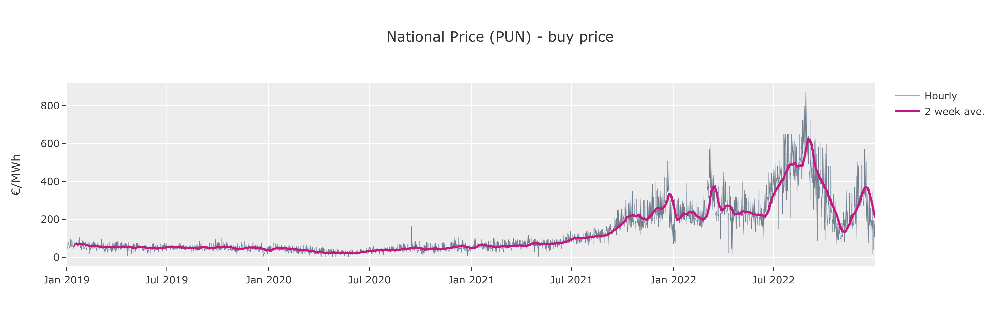

# Italian MGP market

  

Gestore dei Mercati Energetici S.p.A (GME) was set up by Gestore dei Servizi Energetici S.p.A. (GSE), a company wholly owned by the Italian Ministry of Economy and Finance and operating in power, gas, fuel and environmental markets. GME operates several markets:
- Forward physical market (MTE)
- **Day-Ahead hourly auction market (MGP)**
- Daily products market (MPEG)
- Intraday market (MI)
- Ancillary services (MSD), on behalf of the Italian TSO Terna
- Platform for the registration of OTC transactions (PCE)

This repository will collate some of the data available on the GME website to gain a deeper understanding into the MGP market.

## Inital inspection

### Clearing price

  

> The single national price (PUN) over the past 3 years.

Similarly to the GB market, the national clearing prices of the Day-Ahead market remained at a fairly constant price until the latter months of 2021 when the market increase dramatically in volitity.

  

> The average zonal clearing price in 2022.

On the other hand, conversely to the GB market, the clearing price for buyers and sellers is not always the same. In the MGP market, supply offers are evaluated at the clearing price of the zone, whereas demand bids are always paid equally at the PUN, which is a consumption weighted average of the zonal prices. Supplying power from Corsica proves to be the most profitable but for mainland Italy, the north clears higher on average than the south.

  

> Clearing prices Italian MGP vs GB EPEX Day-Ahead market.

After converting the British prices to Euros, it can be seen that the Italian market almost always clears at a higher price, but the the spread of the prices is of a more important factor as this is what will determine the revenue from trading. This will be inspected later.

  

> The average price profile throughout the day.

By averaging the PUN of each hour, the price profile can be seen to have two clear peaks at 9am and 8pm. This second peak is much later in the day than in GB which is likely due to cultural differences.

### Volumes

  

> The MGP supply and demand volume distribution.

Whilst imports from foreign countries may clear at a slightly higher price, the vast majority of supply and demand volume comes from Italy itself - or more specifically, North Italy. 

## 2022 analysis

To find the optimal battery size and location, the potential revenue in 2022 will be calculated from batteries of different sizes and cycle patterns. It should be noted that the revenues calculated are a best case scenario - they are only achievable given a perfect forecasting model which allows the operator to charge and discharge at the peaks and troughs throught the day.

  

> A comparison of the Italian and British Day-Ahead daily peaks and troughs.

It is clear to see that the difference between the peaks and troughs is much greater in the Italian market, and therefore is much likely to return a larger revenue.

### One hour single cycle

  

> Zonal comparison for a single cycle one hour battery.

The revenue from a single cycle battery is easily calculated by subtracting the PUN minimum from the zonal peak of each day and summing each day's revenue together over the course of the year. The North and Central North regions of Italy generate a higher revenue than the rest of the country, however there less than 3 k€/MW difference. The GB Day-Ahead market, on the other hand, had the potential to generate 50.5 k€/MW in 2022, which is less than every region in Italy.

### One hour dual cycle

  

> Zonal comparison for a dual cycle one hour battery.

The revenue from a cycling a battery twice a day can be calculated by splitting the day into a morning and evening cycle. After inspecting the price profile shown in the previous section, which demonstrates two peaks and two troughs, it is a safe assumption that a dual cycle battery will charge and discharge once before 12pm and once after. Following this the potential revenue can be calculated again which again demonstrates the North and Central North regions returning the most, although the order of the bottom three regions is slightly shuffled. This can be compared to the GB market again, which has the potential to return 59.4 k€/MW for a one hour battery operating two cycles a day - far lower than any region in Italy. This is likely due to the fact that the GB price profile does not seem to have a morning peak as in Italy - the higher prices tend to fall in the evening and hence does not benefit from an additional morning cycle to the same extent.

### Two hour single cycle

  

> Zonal comparison for a single cycle two hour battery.

Opting for a larger battery capable of discharging over two hours shows to increase revenue by around 50%, depending on the region. For the majority of regions the increase in revenue is less that 50%, implying that the increase in revenue on battery size is not linear. These values can be compared with GB which is produces returns of 93.2 k€/MW.

### Two hour dual cycle

  

> Zonal comparison for a dual cycle two hour battery.

A two hour dual cycle, again with one before and one after midday has shown to increase revenue again but by less than 50% for all regions when comparing with a two hour single cycle battery. The GB comparison sits at 100.8 k€/MW.

## Comments

What is interesting is that before the volatility increase in 2021, it was Scicily and the South that had the potential to yield the highest returns, yet now it is the North and Central North in every analysis.

It should be noted that the analyses into the different cycle length and (dis)charging durations is relatively low level and is only used to provide an indication into potential revenue and as a comparison to other markets. It relies on several assumptions such as the ability to perfectly forecasts the peaks and troughs of the Day-Ahead prices. It also does not take into account the state of the battery e.g. if the battery finishes the day prior fully charged, it cannot be charged again in the morning of the following day and vice versa.
