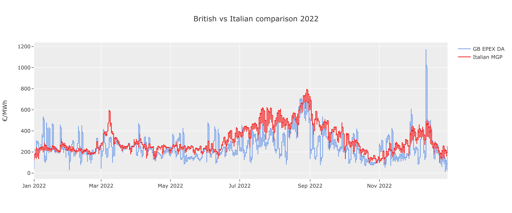
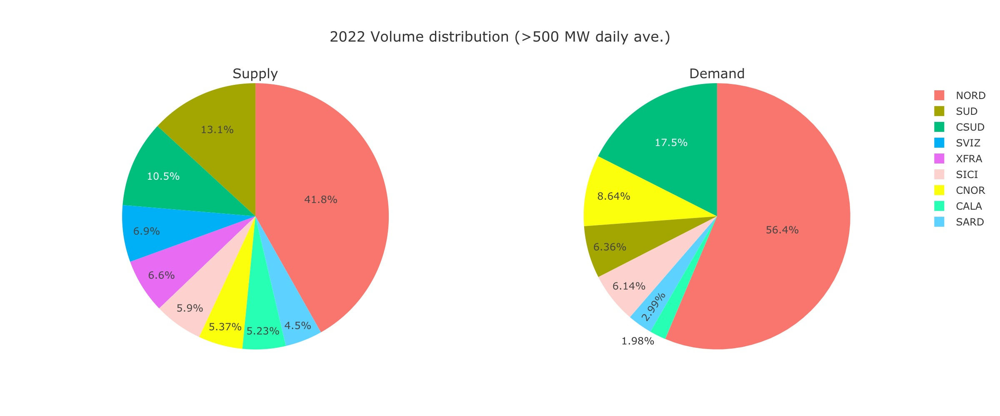

# Italian MGP market

  

Gestore dei Mercati Energetici S.p.A (GME) was set up by Gestore dei Servizi Energetici S.p.A. (GSE), a company wholly owned by the Italian Ministry of Economy and Finance and operating in power, gas, fuel and environmental markets. GME operates several markets:
- Forward physical market (MTE)
- **Day-Ahead hourly auction market (MGP)**
- Daily products market (MPEG)
- Intraday market (MI)
- Ancillary services (MSD), on behalf of the Italian TSO Terna
- Platform for the registration of OTC transactions (PCE)

This repository will collate some of the data available on the GME website to gain a deeper understanding into the MGP market.

## Clearing price

  

> The single national price (PUN) over the past 3 years.

Similarly to the GB market, the national clearing prices of the Day-Ahead market remained at a fairly constant price until the latter months of 2021 when the market increase dramatically in volitity.

  

> The average zonal clearing price in 2022.

Conversely to the GB market, the clearing price for buyers and sellers is not always the same. In the MGP market, supply offers are evaluated at the clearing price of the zone, whereas demand bids are always paid equally at the PUN, which is a consumption weighted average of the zonal prices. Supplying power from Corsica proves to be the most profitable but in terms of mainland italy, the north clears higher on average than the south.

  

> Clearing prices Italian MGP vs GB EPEX Day-Ahead market.

After converting the British prices to Euros, it can be seen that the Italian market almost always clears at a higher price, and so the potential for greater profit is certainly likely.

## Volumes

  

> The MGP supply and demand volume distribution.

